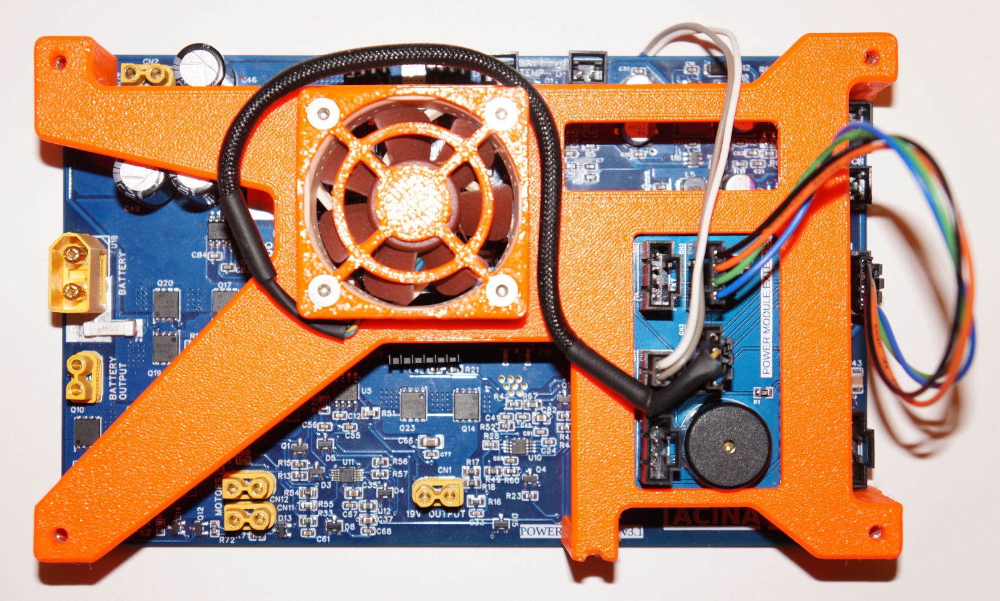

# Power module extender

 Extension board for VITULUS power module.

 For power module board see [Power module](https://github.com/lacina-dev/power_module).
 
 For more info see this doc. 
 [VITULUS Power module assembly and wiring](https://docs.google.com/document/d/1gbUeb38EpmrZyLzsyhS_GtbKjz4Z-vhWeXakbzIWZlc/edit?usp=sharing)

 More about VITULUS? See my website.
 [https://lacina.dev](https://lacina.dev)

 Questions? Try Discord.
 [Discord channel](https://discord.gg/YqeNV5hEVN)

----------

Power module extension board

Power module assembled

